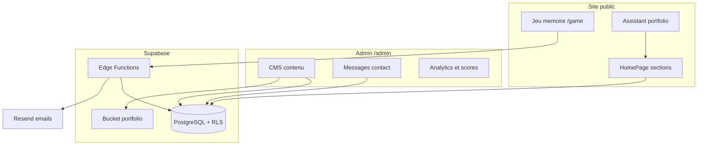

# Portfolio Soufiane HAJJI

Portfolio personnel full-stack — développeur & UI/UX designer. Site vitrine bilingue (FR/EN), back-office admin, contenu géré via Supabase, déployé sur Netlify.

**Stack :** React 19 · Vite 8 · TypeScript · Tailwind CSS v4 · Supabase · Netlify

---

## Aperçu

Le site combine une expérience publique soignée (animations, dark mode, responsive) avec un **CMS intégré** pour modifier profil, projets, compétences et parcours sans toucher au code. Les données vivent dans PostgreSQL (Supabase) ; si Supabase est indisponible, un **fallback statique** (`src/data/` + i18n) prend le relais.



---

## Fonctionnalités

### Site public

| Fonctionnalité | Détail |
|----------------|--------|
| **Sections** | Hero, À propos, Compétences, Expérience, Formation, Projets, Intérêts, Langues, Contact |
| **i18n** | Français / Anglais — contenu CMS + traductions UI |
| **Thème** | Dark / light, transitions de langue |
| **Projets** | Filtres par tag, modal détail (description longue, liens Demo / GitHub) |
| **Contact** | Formulaire → Edge Function → email Resend |
| **Newsletter** | Inscription dans la section Contact |
| **Jeu mémoire** | Page `/game`, classement top 5, record personnel local |
| **Assistant** | Chatbot client-side (sans API LLM) — réponses basées sur le contenu CMS |
| **Analytics** | Événements page, sections, clics projet, contact, jeu, chat (Plausible optionnel) |

### Administration (`/admin`)

| Module | Route | Rôle |
|--------|-------|------|
| Dashboard | `/admin` | Vue d’ensemble |
| **CMS** | `/admin/content/*` | Profil, projets, skills, expérience, formation |
| Messages | `/admin/messages` | Contact reçus, statuts, suppression |
| Analytics | `/admin/analytics` | Journal d’événements + graphique activité |
| Scores jeu | `/admin/scores` | Modération leaderboard |
| Newsletter | `/admin/newsletter` | Abonnés |

**CMS — points clés :**

- Contenu bilingue FR/EN par entité
- Upload Supabase Storage : avatar, logo, CV, images projets (bucket `portfolio`)
- Toggle publié / brouillon, validation basique (slugs, URLs)
- CRUD projets, réseaux sociaux, intérêts, langues parlées

**Auth admin :** Supabase Auth + `app_metadata.role = "admin"`. Reset mot de passe : `/forgot-password` → `/reset-password`.

---

## Prérequis

- **Node.js** 20+
- Projet **Supabase** (Auth, Database, Storage, Edge Functions)
- Compte **Resend** (emails contact / notifications)
- Hébergement **Netlify** (ou équivalent statique + variables d’env)

---

## Installation locale

```bash
git clone <repo-url>
cd susu_portfolio
npm install
cp .env.example .env
```

Renseigner dans `.env` :

```env
VITE_SUPABASE_URL=https://xxxx.supabase.co
VITE_SUPABASE_ANON_KEY=eyJ...
VITE_SITE_URL=http://localhost:5173
```

```bash
npm run dev      # http://localhost:5173
npm run build    # production → dist/
npm run preview  # prévisualiser le build
npm run lint     # ESLint
```

---

## Variables d’environnement

| Variable | Où | Description |
|----------|-----|-------------|
| `VITE_SUPABASE_URL` | `.env` + Netlify | URL du projet Supabase |
| `VITE_SUPABASE_ANON_KEY` | `.env` + Netlify | Clé anon (publique, RLS) |
| `VITE_SITE_URL` | `.env` + Netlify | URL canonique (SEO, OG, emails) |
| `VITE_PLAUSIBLE_DOMAIN` | `.env` (opt.) | Analytics Plausible |
| Secrets Resend, rate limits… | **Supabase → Edge Functions → Secrets** | Jamais dans le repo client |

Liste complète et commentaires : [`.env.example`](.env.example).

---

## Supabase

### 1. Migrations

Appliquer toutes les migrations dans l’ordre :

```bash
supabase link --project-ref <votre-ref>
supabase db push
```

Ou exécuter les fichiers SQL dans **SQL Editor** (`supabase/migrations/`).

Tables principales : contenu portfolio (projets, skills, profil…), `contact_messages`, `memory_leaderboard`, `analytics_events`, `newsletter_subscribers`, vues i18n, RLS admin.

### 2. Edge Functions

| Function | Rôle |
|----------|------|
| `contact` | Formulaire contact + email Resend |
| `submit-score` | Scores jeu mémoire |
| `track-event` | Analytics |
| `subscribe-newsletter` | Inscription newsletter |

```bash
supabase functions deploy contact
supabase functions deploy submit-score
supabase functions deploy track-event
supabase functions deploy subscribe-newsletter
```

Secrets requis (Dashboard) : `RESEND_API_KEY`, `CONTACT_TO_EMAIL`, `CONTACT_FROM_EMAIL`, `PORTFOLIO_SITE_URL`, rate limits — voir `.env.example`.

### 3. Storage

Migration `20250614000000_portfolio_storage.sql` — bucket public **`portfolio`** :

- `avatar/`, `logo/`, `cv/`, `projects/`

Upload depuis l’admin CMS ou URLs manuelles.

### 4. Compte admin

1. **Authentication → Users** : créer un utilisateur, désactiver les inscriptions publiques
2. Attribuer le rôle admin (SQL Editor) :

```sql
-- Voir supabase/scripts/set-admin-role.sql
update auth.users
set raw_app_meta_data = raw_app_meta_data || '{"role":"admin"}'::jsonb
where email = 'votre@email.com';
```

3. **Auth → URL Configuration** : Site URL + Redirect URLs (`/login`, `/reset-password`)

### 5. Peupler le CMS (seed)

Données de référence : [`supabase/seed/portfolio-snapshot.json`](supabase/seed/portfolio-snapshot.json)

```bash
npm run cms:seed:sql
supabase db query -f supabase/scripts/refresh-cms-from-snapshot.sql --linked
```

Ré-exécutable (upsert) pour réinitialiser le contenu depuis le snapshot.

### 6. Plan gratuit — keep-alive

Le workflow [`.github/workflows/supabase-keepalive.yml`](.github/workflows/supabase-keepalive.yml) ping Supabase 2×/semaine. Configurer les secrets GitHub `SUPABASE_URL` et `SUPABASE_ANON_KEY`.

---

## Guide portfolio (sans IA)

Assistant **100 % client-side** — pas d’API OpenAI, pas de modèle local, **pas de champ texte libre**.

- Menu par **catégories** (À propos, Compétences, Projets, Contact…)
- Sous-menu **Projets** avec fiche détaillée par projet
- Réponses tirées du CMS + liens actionnables (sections, GitHub, WhatsApp, CV, jeu)
- **Synthèse vocale** : fichiers audio Piper pré-générés (lecture instantanée) + fallback Web Speech
- Widget flottant bas-gauche sur `/` et `/game`
- Code : `src/lib/portfolioChat/`, `src/hooks/usePortfolioGuide.ts`, `src/components/chat/PortfolioChatWidget.tsx`

### Audio guide (Piper TTS)

Voix open source : **fr_FR-tom-medium** (FR) · **en_US-ryan-medium** (EN).

```bash
npm run guide:audio        # génère public/audio/guide/{fr,en}/*.wav
npm run guide:audio:force  # régénère tout
```

À relancer après modification du contenu CMS / textes du guide. Fichiers servis statiquement — **0 € d’API**, lecture au clic sans latence de synthèse.

---

## Assets publics

Fichiers dans `public/` — inventaire : [`public/ASSETS.md`](public/ASSETS.md).

| Fichier | Usage |
|---------|--------|
| `logo.png` | Navbar, footer, guide portfolio, OG |
| `hajji-bg.png` | Fallback photo profil |
| `favicon.svg` | Favicon |
| `placeholder-project.svg` | Projets sans capture |
| `CV_Soufiane.pdf` | CV (ou upload CMS) |

Images projets : upload admin → Storage, ou fichiers dans `public/projects/`.

---

## Déploiement (Netlify)

1. Connecter le repo
2. Build command : `npm run build`
3. Publish directory : `dist`
4. Variables d’environnement :
   - `VITE_SUPABASE_URL`
   - `VITE_SUPABASE_ANON_KEY`
   - `VITE_SITE_URL` (URL Netlify finale)
5. Redéployer après changement des variables

---

## Structure du projet

```
src/
  components/
    sections/       # Hero, About, Skills, Projects, Contact…
    chat/           # Assistant portfolio
    admin/          # Layout, CMS, formulaires
    layout/         # Navigation, Footer, Container
    ui/             # Button, Card, Dialog, Input…
  hooks/            # Auth, contenu portfolio, chat, thème
  services/         # Supabase, contact, analytics, CMS admin
  lib/
    portfolioChat/  # Moteur guide (knowledge, topics, réponses)
    staticPortfolio.ts
  i18n/             # FR / EN
  data/             # Fallback statique si Supabase indisponible
  pages/            # Home, Game, Admin, Auth

supabase/
  migrations/       # Schéma PostgreSQL + RLS + seeds
  functions/        # Edge Functions Deno
  seed/             # portfolio-snapshot.json
  scripts/          # set-admin-role.sql, refresh-cms-from-snapshot.sql

scripts/
  generate-cms-seed.mjs   # Génère le SQL seed depuis le snapshot
  generate-logo-base64.mjs
```

---

## Scripts npm

| Commande | Description |
|----------|-------------|
| `npm run dev` | Serveur de développement Vite |
| `npm run build` | Build production TypeScript + Vite |
| `npm run preview` | Prévisualiser `dist/` |
| `npm run lint` | ESLint |
| `npm run cms:seed:sql` | Génère `supabase/scripts/refresh-cms-from-snapshot.sql` |
| `npm run logo:generate` | Met à jour le logo base64 pour les emails |

---

## Licence

Projet privé — © Soufiane HAJJI.
