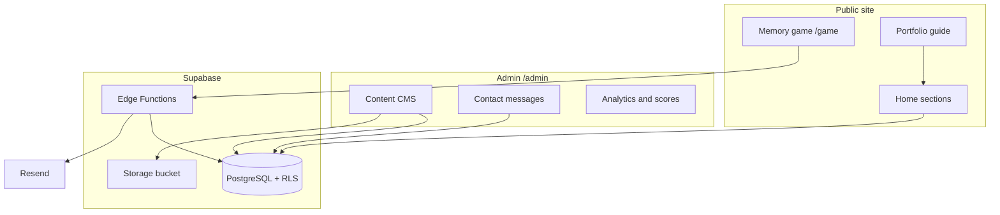

# Portfolio — Soufiane HAJJI

Personal full-stack portfolio for a developer and UI/UX designer. Bilingual public site (French / English), integrated CMS, and Supabase backend, deployed as a static SPA on Netlify.

| Layer | Stack |
|-------|--------|
| Frontend | React 19, TypeScript, Vite 8, Tailwind CSS v4, Framer Motion |
| Backend | Supabase (PostgreSQL, Auth, Storage, Edge Functions) |
| Email | Resend (via Edge Functions) |
| Hosting | Netlify |

---

## Overview

The application pairs a polished public experience (responsive layout, dark mode, motion) with an admin CMS to manage profile, projects, skills, and career content without editing source code.

Content is stored in PostgreSQL (Supabase). If Supabase is unreachable, a static fallback (`src/data/` + i18n) keeps the site available.



---

## Features

### Public site

| Feature | Description |
|---------|-------------|
| Sections | Hero, About, Skills, Experience, Education, Projects, Interests, Languages, Contact |
| i18n | French / English — CMS entity copy + UI strings |
| Theme | Dark / light with language transition |
| Projects | Tag filters, detail dialog, demo and GitHub links |
| Contact | Form → Edge Function → Resend email |
| Newsletter | Subscription from the Contact section |
| Memory game | `/game` with leaderboard and local personal best |
| Portfolio guide | Client-side menu assistant (no LLM API), CMS-backed answers, optional Piper TTS |
| Analytics | Custom events (page, section, project, contact, game, guide) + optional Plausible |

### Admin (`/admin`)

| Module | Route | Purpose |
|--------|-------|---------|
| Dashboard | `/admin` | Overview metrics |
| Content CMS | `/admin/content/*` | Profile, projects, skills, experience, education |
| Messages | `/admin/messages` | Contact inbox, status, delete |
| Analytics | `/admin/analytics` | Event log and activity chart |
| Game scores | `/admin/scores` | Leaderboard moderation |
| Newsletter | `/admin/newsletter` | Subscriber list |

CMS capabilities:

- Bilingual FR/EN fields per entity
- Supabase Storage uploads (avatar, logo, CV, project images — bucket `portfolio`)
- Publish / draft toggle and basic validation (slugs, URLs)
- CRUD for projects, social links, interests, spoken languages

Admin auth uses Supabase Auth with `app_metadata.role = "admin"`. Password recovery: `/forgot-password` → `/reset-password`.

---

## Prerequisites

- Node.js 20+
- Supabase project (Auth, Database, Storage, Edge Functions)
- Resend account (contact email delivery)
- Netlify (or any static host with environment variables)

---

## Local setup

```bash
git clone https://github.com/suufiaane13/my-portfolio.git
cd my-portfolio
npm install
cp .env.example .env
```

Configure `.env`:

```env
VITE_SUPABASE_URL=https://xxxx.supabase.co
VITE_SUPABASE_ANON_KEY=eyJ...
VITE_SITE_URL=http://localhost:5173
```

```bash
npm run dev       # http://localhost:5173
npm run build     # production build → dist/
npm run preview   # preview production build
npm run lint      # ESLint
```

---

## Environment variables

| Variable | Scope | Description |
|----------|-------|-------------|
| `VITE_SUPABASE_URL` | Client + Netlify | Supabase project URL |
| `VITE_SUPABASE_ANON_KEY` | Client + Netlify | Anon key (public; protected by RLS) |
| `VITE_SITE_URL` | Client + Netlify | Canonical site URL (SEO, OG, emails) |
| `VITE_PLAUSIBLE_DOMAIN` | Client (optional) | Plausible analytics domain |
| Resend, rate limits, IP salt | Supabase Edge Function secrets only | Never commit to the client repo |

Full reference: [`.env.example`](.env.example).

---

## Supabase

### Migrations

```bash
supabase link --project-ref <project-ref>
supabase db push
```

Alternatively, run SQL files from `supabase/migrations/` in the SQL Editor (order by filename).

Main domains: portfolio content tables and i18n views, `contact_messages`, memory scores / leaderboard, `portfolio_events`, `newsletter_subscribers`, admin RLS, Storage policies.

### Edge Functions

| Function | Role |
|----------|------|
| `contact` | Contact form + Resend emails |
| `submit-score` | Memory game score submission |
| `track-event` | Analytics ingestion |
| `subscribe-newsletter` | Newsletter signup |

```bash
supabase functions deploy contact
supabase functions deploy submit-score
supabase functions deploy track-event
supabase functions deploy subscribe-newsletter
```

Required secrets (Supabase Dashboard → Edge Functions → Secrets): `RESEND_API_KEY`, `CONTACT_TO_EMAIL`, `CONTACT_FROM_EMAIL`, `PORTFOLIO_SITE_URL`, rate-limit and hashing settings — see `.env.example`.

### Storage

Migration `20250614000000_portfolio_storage.sql` creates the public `portfolio` bucket with folders:

`avatar/`, `logo/`, `cv/`, `projects/`

Uploads are managed from the admin CMS (or via direct public URLs).

### Admin account

1. Authentication → Users: create a user; disable public sign-ups.
2. Grant admin role (SQL Editor):

```sql
-- See supabase/scripts/set-admin-role.sql
update auth.users
set raw_app_meta_data = raw_app_meta_data || '{"role":"admin"}'::jsonb
where email = 'you@example.com';
```

3. Authentication → URL Configuration: set Site URL and Redirect URLs (`/login`, `/reset-password`).

### CMS seed

Reference snapshot: [`supabase/seed/portfolio-snapshot.json`](supabase/seed/portfolio-snapshot.json)

```bash
npm run cms:seed:sql
supabase db query -f supabase/scripts/refresh-cms-from-snapshot.sql --linked
```

Idempotent upsert — safe to re-run to reset content from the snapshot.

### Free plan keep-alive

Free-tier Supabase projects pause after approximately **7 days** of database inactivity. This repository includes a scheduled GitHub Action that performs a read-only REST ping twice per week.

Workflow: [`.github/workflows/supabase-keepalive.yml`](.github/workflows/supabase-keepalive.yml)

**Repository secrets** (Settings → Secrets and variables → Actions → Repository secrets) — not Environment secrets:

| Secret | Value |
|--------|--------|
| `SUPABASE_URL` | Same as `VITE_SUPABASE_URL` |
| `SUPABASE_ANON_KEY` | Same as `VITE_SUPABASE_ANON_KEY` |

Schedule: Monday and Thursday 08:00 UTC (`workflow_dispatch` available for manual runs).

For production uptime without relying on cron, use the Supabase Pro plan (no inactivity pause).

---

## Portfolio guide

Client-side assistant — no OpenAI API, no local LLM, no free-text input.

- Topic menu (About, Skills, Projects, Contact, etc.)
- Project submenu with per-project detail
- Answers derived from CMS content, with actionable links (sections, GitHub, WhatsApp, CV, game)
- Speech: pre-generated Piper WAV files + Web Speech API fallback
- Floating widget on `/` and `/game`

Source: `src/lib/portfolioChat/`, `src/hooks/usePortfolioGuide.ts`, `src/components/chat/PortfolioChatWidget.tsx`

### Guide audio (Piper TTS)

Voices: `fr_FR-tom-medium` (FR), `en_US-ryan-medium` (EN).

```bash
npm run guide:audio         # generate public/audio/guide/{fr,en}/*.wav
npm run guide:audio:force   # regenerate all files
```

Re-run after CMS or guide text changes. Audio is served statically (no TTS API cost).

---

## Public assets

Inventory: [`public/ASSETS.md`](public/ASSETS.md)

| File | Usage |
|------|--------|
| `logo.png` | Navbar, footer, guide, Open Graph fallback |
| `hajji.png` | Profile photo fallback |
| `favicon.svg` | Favicon |
| `placeholder-project.svg` | Projects without a screenshot |
| `CV_Soufiane.pdf` | CV download (or CMS Storage URL) |

Project images: upload via admin → Storage, or place files under `public/projects/`.

---

## Deployment (Netlify)

1. Connect the GitHub repository
2. Build command: `npm run build`
3. Publish directory: `dist`
4. Environment variables:
   - `VITE_SUPABASE_URL`
   - `VITE_SUPABASE_ANON_KEY`
   - `VITE_SITE_URL` (production URL)
5. Redeploy after changing environment variables

---

## Project structure

```
src/
  components/
    sections/       # Public page sections + memory game
    chat/           # Portfolio guide widget
    admin/          # Admin layout and CMS UI
    layout/         # Navigation, footer, container
    ui/             # Shared primitives
  hooks/            # Auth, content, guide, theme, game
  services/         # Supabase clients, contact, analytics, admin CRUD
  lib/
    portfolioChat/  # Guide knowledge and topics
    staticPortfolio.ts
  i18n/             # FR / EN
  data/             # Static fallback when Supabase is down
  pages/            # Home, Game, Admin, Auth

supabase/
  migrations/       # Schema, RLS, seeds
  functions/        # Deno Edge Functions
  seed/             # portfolio-snapshot.json
  scripts/          # Admin role + CMS refresh SQL

scripts/
  generate-cms-seed.mjs
  generate-guide-audio.ts
  generate-logo-base64.mjs

.github/workflows/
  supabase-keepalive.yml
```

---

## npm scripts

| Command | Description |
|---------|-------------|
| `npm run dev` | Vite development server |
| `npm run build` | TypeScript check + production build |
| `npm run preview` | Serve `dist/` locally |
| `npm run lint` | ESLint |
| `npm run cms:seed:sql` | Generate CMS refresh SQL from snapshot |
| `npm run guide:audio` | Generate Piper guide audio (incremental) |
| `npm run guide:audio:force` | Regenerate all guide audio |
| `npm run logo:generate` | Refresh base64 logo for contact email templates |

---

## License

Private project. All rights reserved — Soufiane HAJJI.
